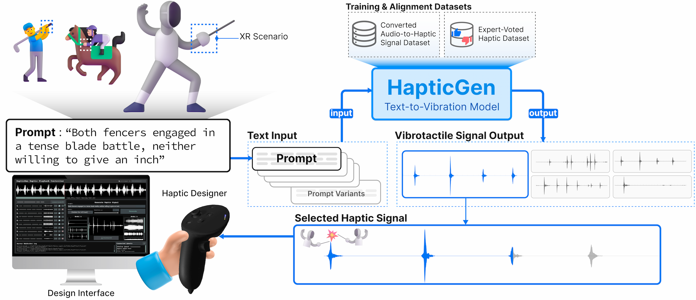
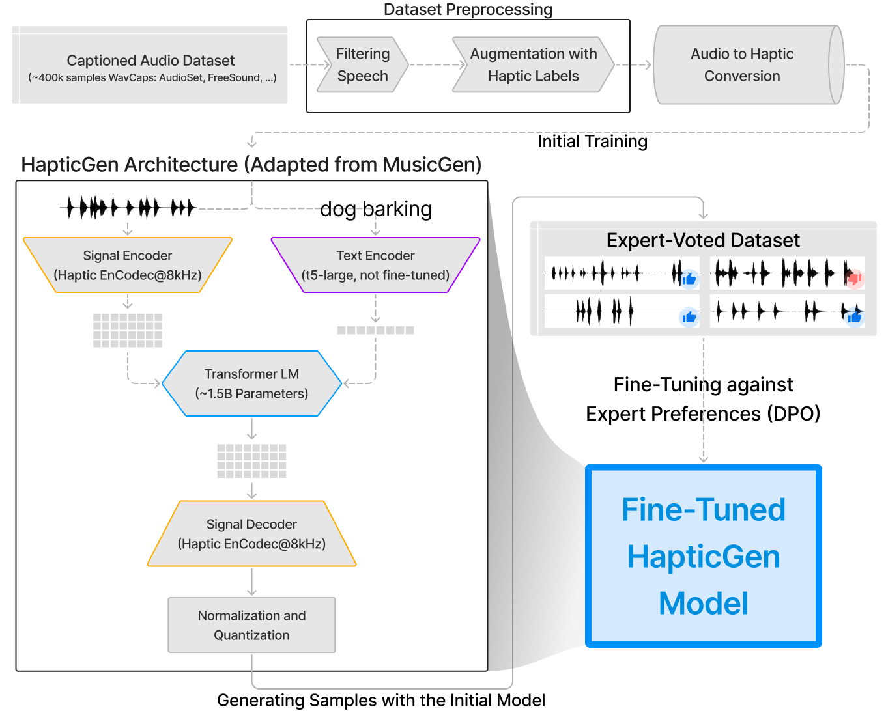

# HapticGen
HapticGen is a generative model designed to create vibrotactile haptic signals from text inputs.

This repository contains modifications to Meta Research's [AudioCraft](https://github.com/facebookresearch/audiocraft), primarily in the dataloader and solver components, used to train and fine-tune the HapticGen model.

## Installation
The installation process is similar to AudioCraft, but some dependencies have changed. For detailed instructions, please refer to [README-audiocraft.md](README-audiocraft.md).
The current required dependencies can be found in [requirements.txt](requirements.txt) or [requirements.beamcloud.txt](requirements.beamcloud.txt).

## Training
To train and fine-tune the HapticGen model as discussed in the paper, refer to the [HapticGen grid](./audiocraft/grids/hapticgen/hapticgen_minimal.py).
<!--   -->

    

## Inference
For inference, refer to [audiogen-beam-serve.py](audiogen-beam-serve.py). This script was used to host and serve both the text-to-audio plus audio-to-haptics baseline and the direct text-to-haptics HapticGen model for our user study. It can also be run locally from the command line for testing (local inference).

## Model Weights
The fine-tuned HapticGen model weights are available on HuggingFace at [HapticGen/HapticGen-Weights](https://huggingface.co/HapticGen/HapticGen-Weights).

## Datasets
The HapticGen datasets are available on GitHub at: [HapticGen/hapticgen-dataset](https://github.com/HapticGen/hapticgen-dataset).

# Publication
Youjin Sung, Kevin John, Sang Ho Yoon, and Hasti Seifi. 2025. HapticGen: Generative Text-to-Vibration Model for Streamlining Haptic Design. In CHI Conference on Human Factors in Computing Systems (CHI ’25), April 26-May 1, 2025, Yokohama, Japan. ACM, New York, NY, USA, 23 pages. https://doi.org/10.1145/3706598.3713609
